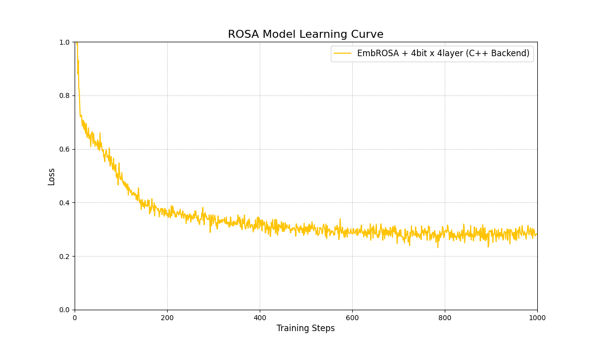

# High-Performance CUDA Implementation of the ROSA Algorithm



This repository provides a high-performance PyTorch CUDA extension for the **ROSA (Rapid Online Suffix Automaton)** algorithm, designed to significantly accelerate sequence processing tasks in neural networks. This implementation achieves up to a **30x speedup** over the original Python version, making it suitable for both training and inference at scale.

This work is inspired by and can be integrated into architectures like RWKV.

## Features

-   **Massive Speedup**: Achieves up to a **30x performance gain** by parallelizing the algorithm across the batch dimension on NVIDIA GPUs.
-   **PyTorch Integration**: Seamlessly integrates as a C++/CUDA extension, callable directly from Python like any other PyTorch module.
-   **Cross-Platform**: While developed on Windows, the code is standard and easily compilable on Linux systems.
-   **Efficient Memory Management**: All automaton structures are pre-allocated on the GPU, minimizing overhead.

## Performance Benchmark

Performance comparison against the original sequential Python implementation.

| Implementation | Batch Size | Sequence Length | Average Time | Speedup |
| :------------- | :--------: | :-------------: | :----------: | :-----: |
| Python (CPU)   |    128     |       128       |  ~33.87 ms   |   1x    |
| **CUDA (GPU)** |  **128**   |     **128**     |  **~1.11 ms**  | **~30x**  |

*Benchmark conducted on an NVIDIA GPU (GTX 1070) with CUDA 12.8.*

## Prerequisites

### Windows

-   **Visual Studio**: 2022 or later, with the "Desktop development with C++" workload installed. This provides the necessary C++ toolchain (`cl.exe`).
-   **NVIDIA GPU**: A CUDA-enabled NVIDIA GPU with up-to-date drivers.
-   **NVIDIA CUDA Toolkit**: Version **12.8** is recommended. [Download here](https://developer.nvidia.com/cuda-12-8-0-download-archive).

### Linux

-   A C++ compiler like `g++`.
-   NVIDIA GPU and drivers.
-   NVIDIA CUDA Toolkit.

## Getting Started

These instructions use [**uv**](https://github.com/astral-sh/uv), a fast Python package installer and resolver. You can also use `pip` and `venv`.

1.  **Clone the repository:**
    ```bash
    git clone https://github.com/Juste-Leo2/ROSA-GPU-RWKV8.git
    cd ROSA-GPU-RWKV8
    ```

2.  **Open the Correct Terminal (Windows Only):**
    For the compilation to find the C++ tools, you **must** use a developer terminal. Search for and open:
    `x64 Native Tools Command Prompt for VS 2022` (or your VS version).

3.  **Set up the Python Environment:**
    ```bash
    # Create a virtual environment using Python 3.11
    uv venv -p 3.11

    # Activate the environment
    # On Windows
    .venv\Scripts\activate
    # On Linux/macOS
    # source .venv/bin/activate
    ```

4.  **Install Dependencies and Compile the Extension:**
    This command will first install PyTorch and other requirements, then compile and install the ROSA CUDA extension in "editable" mode.
    ```bash
    uv pip install -r requirements.txt
    uv run build.py
    ```
    The compilation may take a minute. If successful, the extension is ready to be imported in Python.

## Usage

### Example: Training a Mini-Model

To see the extension in action, you can run the example training script:

```bash
uv run test_rosa_extension.py
uv run examples/train_rosa.py
```

### Direct Import

Once installed, you can import and use the extension directly in your PyTorch projects:

```python
import torch
import rosa_cuda_ext # The compiled module

# Create a batch of long tensors on the GPU
input_tensor = torch.randint(0, 10, (128, 128), dtype=torch.long, device='cuda')

# Apply the ROSA algorithm in parallel on the GPU
output_tensor = rosa_cuda_ext.forward(input_tensor)

print("Input shape:", input_tensor.shape)
print("Output shape:", output_tensor.shape)
```

## Acknowledgements

A special thanks to **BlinkDL** for his groundbreaking work on the RWKV architecture, which continues to inspire innovation in the field of sequence modeling.

## License


This project is distributed under the **Apache 2.0 License**. See the `LICENSE` file for more details.

